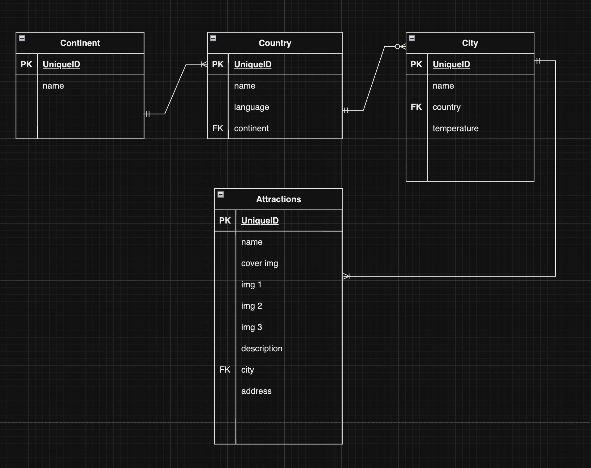

# lovelyworld

## ERD List

## Wireframe

## File Structure

├── client/
│ ├── index.html
│ ├── style.css
│ └── script.js
├── controllers
│ ├── continentController.js
│ ├── countryController.js
│ ├── cityController.js
│ ├── attractionController.js
├── db
│ ├── index.js
├── models
│ ├── index.js
│ ├── continent.js
│ ├── country.js
│ ├── city.js
│ ├── attraction.js
└── seed
│ ├── continents.js
│ ├── countries.js
│ ├── cities.js
│ ├── attractions.js
└── .gitignore
└── server.js
└── README.md
└── package.json
└── package-lock.json

## User Story

As a user, I want to

- easily navigate the website so that I can find the information I'm looking for quickly.
- view high-quality images and descriptions of destinations to inspire my travel plans.
- create an account so that I can personalize my experience and save my favorite destinations.
- search for destinations based on different criteria (like location, weather, or budget) to find places that match my travel preferences.
- discover new travel destinations through recommendations and featured content.

## MVP (Minimum Viable Product)

Core Features:
Destination guides with detailed descriptions and high-quality images.
Basic search functionality to find destinations by name or category (e.g. temperature, cities).
Users can save their favorite destinations to their profile for easy access.

Design and Layout:
A clean, user-friendly interface that is responsive and works well on both desktop and mobile devices.

## Stretch Goals

Content Management:
A backend system for users to create, update, and delete destination guides and articles.

User Engagement:
Basic review system where registered users can leave a comment and a rating for a destination.
